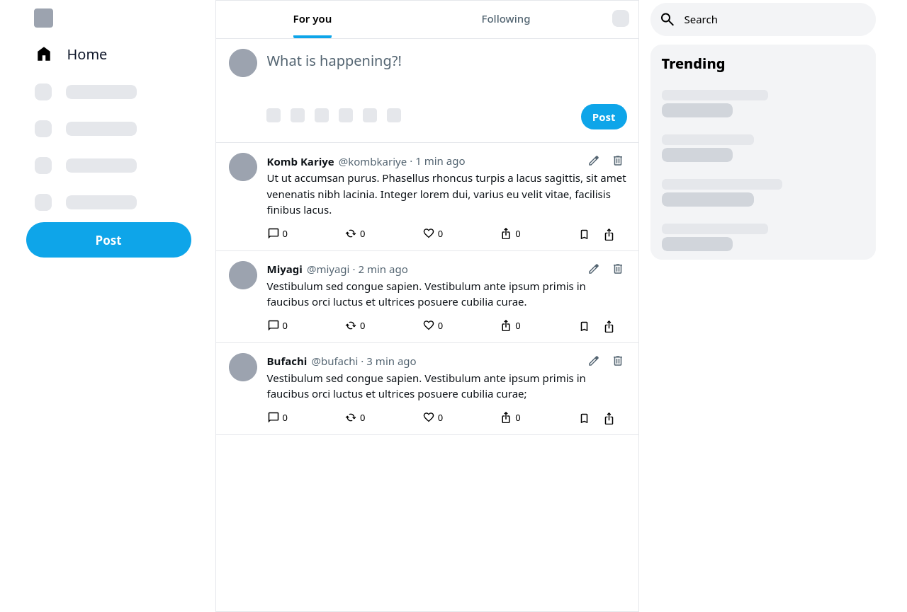
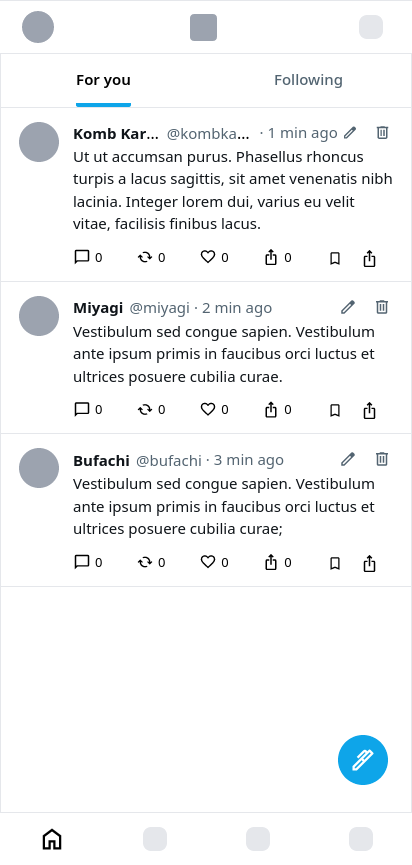

# React / Typescript Technical Test

**Note:**
Icons & Fonts may look different due to possibly being subject to copyright.

Because of bugs and time constraint, edit & delete UI has been improvised.

### What's missing?
* Toasts
* Error handling
    * *Why*? Hard to simulate on subject.  
* Unit & intergration tests
    * *Why*? Assuming not necessary, if assessment includes visual inspection of code.

### Screenshot

&nbsp;&nbsp;&nbsp;
