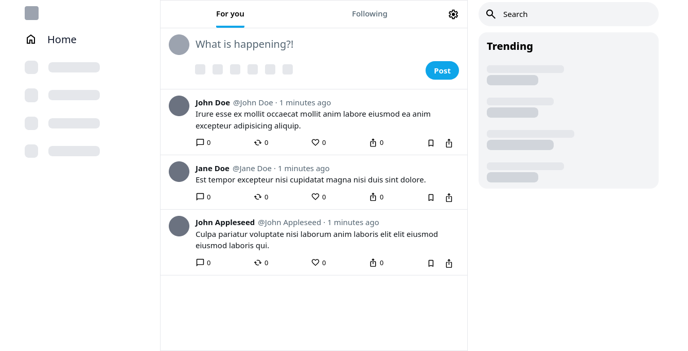

# React / Typescript Technical Test

**Note:**
Icons & Fonts may look different due to possibly being subject to copyright. 

### What's missing?

* Error handling
    * *Why*? Hard to simulate on subject & design not provided.  
* Unit & intergration tests
    * *Why*? Assuming not necessary, if assessment includes visual inspection of code.

### Todo

* Get post by id
* Update post
* Delete post
* Responsiveness
* UI polishing
* Code cleanup

### Screenshot
